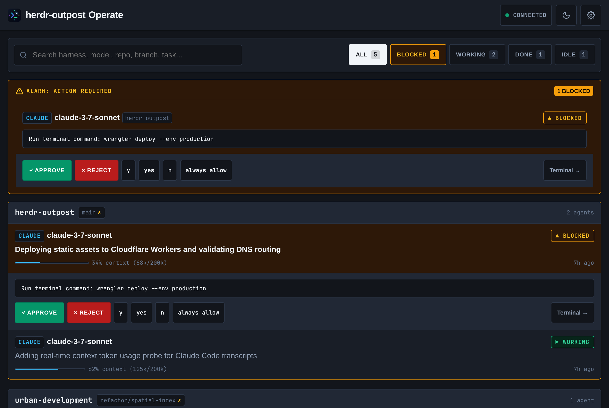
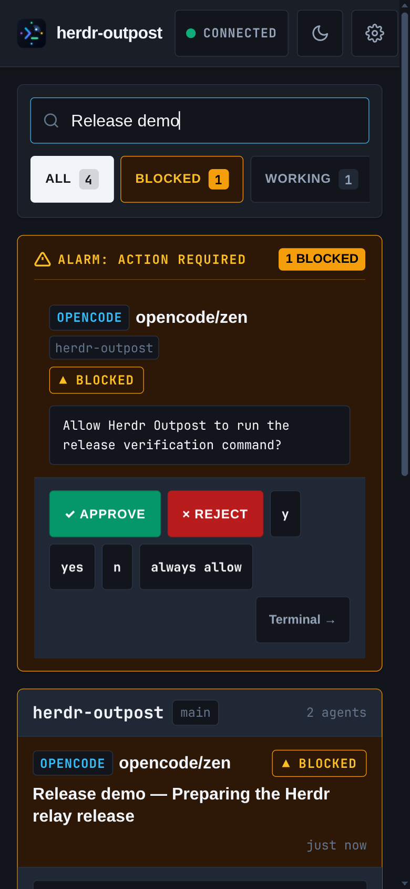
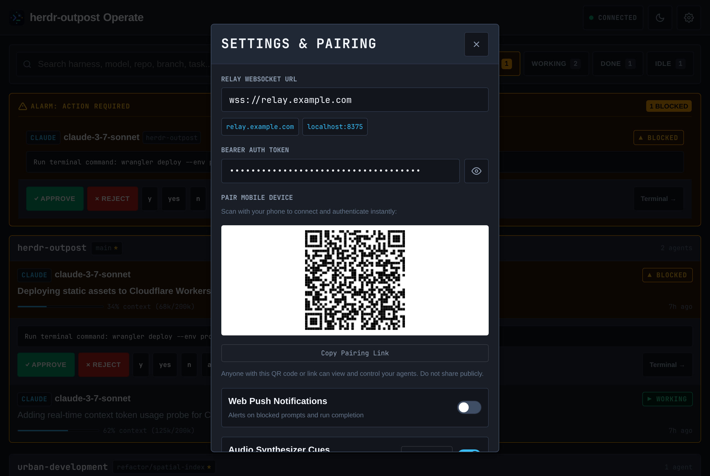
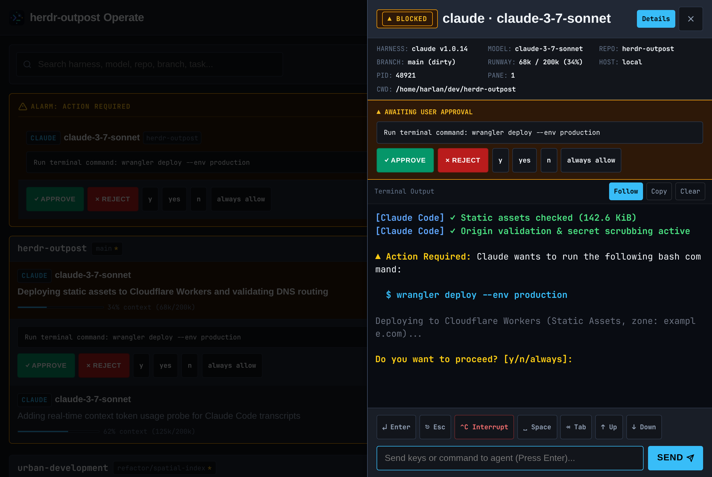

# herdr-outpost

[](tests/)
[](https://python.org)
[](https://workers.cloudflare.com)
[](https://developers.cloudflare.com/cloudflare-one/connections/connect-apps/)
[](LICENSE)

> **herdr-outpost** is a lightweight, secure remote dashboard and relay gateway for [Herdr](https://herdr.dev) — the terminal workspace manager for AI coding agents. The reference deployment hosts the dashboard globally on **Cloudflare Workers** (static assets) and exposes local or multi-host agent relays securely via **Cloudflare Tunnel**. The dashboard is a zero-build static site and the relay is a standalone Python daemon, so both also run natively on several other platforms — see [Alternative Deployment Platforms](#-alternative-deployment-platforms).

<p align="center">
  
</p>

---

## Table of Contents

- [Overview & Architecture](#-overview--architecture)
- [Key Features](#-key-features)
- [Prerequisites](#-prerequisites)
- [Quick Start (5 Minutes)](#-quick-start-5-minutes)
- [Step-by-Step Installation & Deployment](#-step-by-step-installation--deployment)
  - [1. Clone Repository](#1-clone-repository)
  - [2. Configure Environment](#2-configure-environment)
  - [3. Configure Cloudflare Tunnel](#3-configure-cloudflare-tunnel)
  - [4. Deploy Frontend to Cloudflare Workers](#4-deploy-frontend-to-cloudflare-workers)
  - [5. Run Relay Daemon](#5-run-relay-daemon)
- [Telegram Bot Setup](#-telegram-bot-setup)
- [Web Push (VAPID) Setup](#-web-push-vapid-setup)
- [Multi-Host & SSH Agent Monitoring](#-multi-host--ssh-agent-monitoring)
- [Live Agent Telemetry (harness, model, context, git)](#live-agent-telemetry-harness-model-context-git)
- [Session Deep Links & Lifecycle](#-session-deep-links--lifecycle)
- [Security & Hardening Best Practices](#-security--hardening-best-practices)
- [Alternative Deployment Platforms](#-alternative-deployment-platforms)
- [Automated Testing & QA](#-automated-testing--qa)
- [Troubleshooting](#-troubleshooting)
- [License & Contributing](#-license--contributing)

---

## Overview & Architecture

`herdr-outpost` bridges your active local development workspace and remote development machines to any browser device (desktop, tablet, mobile). You can monitor agent progress in real time, inspect ANSI terminal output, approve/reject permission prompts, and receive push notifications when an agent is blocked or completed.

```
┌─────────────────────────────────────────────────────────────────────────────┐
│                           Cloudflare Edge Network                           │
│                            (e.g., example.com)                              │
└───────────────────────┬─────────────────────────────┬───────────────────────┘
                        │                             │
       HTTPS Requests   │            WSS / Ingress    │
       (Custom Domain)  │            (Encrypted)      │
               ┌────────▼─────────┐          ┌────────▼─────────┐
               │Cloudflare Workers│          │ Cloudflare Tunnel│
               │ (Web Dashboard)  │          │   (cloudflared)  │
               │  herdr.domain    │          │   relay.domain   │
               └────────┬─────────┘          └────────┬─────────┘
                        │                             │
                        │ Static Assets               │ Secure Ingress
                        │ (HTML/CSS/JS)               │ (Loopback proxy)
                        │                             │
               ┌────────▼─────────────────────────────▼─────────┐
               │              Browser Client (Mobile/Desktop)   │
               │   - Real-time ANSI Terminal Stream             │
               │   - One-touch Approvals & Prompts              │
               │   - Web Push Notifications                     │
               └────────────────────────────────────────────────┘
                                      ▲
                                      │ WebSocket / Bearer Token
                                      │
               ┌──────────────────────┴─────────────────────────┐
               │         herdr-outpost Relay Daemon (Python)    │
               │         - Strict Origin & Token Verification   │
               │         - Secret Scrubbing Filter              │
               │         - Local IPC & Socket Polling           │
               └───────────┬─────────────────────────┬──────────┘
                           │                         │
            Local Agent IPC│             SSH / IPC   │
                           ▼                         ▼
                 [Local Herdr Panes]       [Remote Server Panes]
```

---

## Key Features

- **Mobile-First Triage & Annunciator Panel**: Management-by-exception board with an instant top ALARM strip for one-touch approvals (`✓ Approve`, `✕ Reject`, quick response chips `y`, `yes`, `always allow`) without opening a full terminal.
- **Path-Based Session Deep Links (`/session/{id}`)**: First-class URL routing with browser history support (`pushState`/`popstate`), direct push notification navigation, and zero-config SPA fallback.
- **Session Lifecycle & Automatic Reconciliation**: Multi-host polling reconciles active sessions against `herdr agent list` (2-miss grace period pruning) and expires hook/UDP sessions after a configurable TTL (`HERDR_OUTPOST_SESSION_TTL`), broadcasting real-time `agent_removed` events.
- **Zero-Build Web UI**: Instant static dashboard deployable directly to Cloudflare Workers (or any static host).
- **High-Fidelity ANSI Streaming & Buffer Capping**: Terminal pane streaming with rich color ANSI parsing and memory-safe buffer management.
- **Interactive Control & Action Debouncing**: Prompt agents, send text, approve actions, reject actions, or interrupt running tasks from any browser with duplicate-click protection.

<p align="center">
  
</p>

- **Production Hardening & Offline Resilience**:
  - Offline network detection banner with automatic reconnect upon connection restoration.
  - Heartbeat ping-pong watchdog detecting dead sockets within 12 seconds.
  - Modal focus trapping, full keyboard accessibility, and minimum 44px touch targets.
  - Comprehensive XSS protection and diacritic-insensitive search.
- **Enterprise Security**:
  - Centralized **Secret Scrubbing** (`scrub()`) prevents token or credential leakage in logs, messages, and error dumps.
  - **Strict Origin Validation** against `HERDR_OUTPOST_TRUSTED_ORIGINS`.
  - Constant-time token verification for all WebSocket and HTTP requests.
- **Multi-Host Aggregation**: Monitor agents across local workstations and remote SSH machines simultaneously.
- **Dual Notification Pipelines**: Instant alerts via **Telegram Bot** and standard browser **Web Push** (VAPID).
- **Background Daemon & Service**: Includes setup scripts for `systemd` (Linux), `launchd` (macOS), and Task Scheduler (Windows).

---

## Prerequisites

Before setting up `herdr-outpost`, ensure you have:

1. **A Cloudflare Account & Domain** (e.g. `example.com`).
2. **`herdr` CLI (0.7+)** installed on your workstation ([herdr.dev](https://herdr.dev)).
3. **`uv`** (modern Python package and project manager) or Python 3.11+.
4. **`cloudflared`** CLI ([Cloudflare Tunnel Download](https://developers.cloudflare.com/cloudflare-one/downloads/)).
5. **Node.js & Wrangler** (optional, for deploying to Workers via CLI): `npm install -g wrangler`.

> Deploying to Cloudflare is the reference path documented below, but nothing in `herdr-outpost` is Cloudflare-specific — see [Alternative Deployment Platforms](#-alternative-deployment-platforms) if you'd rather host the dashboard and relay elsewhere.

---

## Quick Start (5 Minutes)

```bash
# 1. Clone repository
git clone https://github.com/harlanljones/herdr-outpost
cd herdr-outpost

# 2. Copy and customize configuration
cp config/config.env.example config.env
# Edit config.env with your secure token and domain

# 3. Create Cloudflare Tunnel
cloudflared tunnel create herdr-outpost
cloudflared tunnel route dns herdr-outpost relay.example.com
cloudflared tunnel route dns herdr-outpost herdr.example.com

# 4. Deploy web dashboard to Cloudflare Workers
cd web && wrangler deploy && cd ..

# 5. Start relay daemon
cd relay && ./start.sh
```

Open `https://herdr.example.com` in your browser and enter your bearer token to connect.

**Pairing a phone or second device:** once one browser is connected, open Settings there and scan the "Pair a Device" QR code with your phone's camera (or use Copy Link). This opens the dashboard already signed in — no need to type the token again. The QR/link embeds the same bearer token, so treat it like the token itself: display it in person rather than sending it over email or chat, and rotating `HERDR_OUTPOST_RELAY_TOKEN` (see Security below) invalidates it just like any other paired device.

<p align="center">
  
</p>

---

## Step-by-Step Installation & Deployment

### 1. Clone Repository

```bash
git clone https://github.com/harlanljones/herdr-outpost
cd herdr-outpost
```

### 2. Configure Environment

Create your production environment file (e.g. at `~/.config/herdr-outpost/config.env` or in your working directory):

```bash
mkdir -p ~/.config/herdr-outpost
cp config/config.env.example ~/.config/herdr-outpost/config.env
```

Generate a secure 256-bit token:
```bash
TOKEN=$(openssl rand -hex 32)
echo "Generated Token: $TOKEN"
```

Edit `~/.config/herdr-outpost/config.env`:
```bash
HERDR_OUTPOST_RELAY_PORT=8375
HERDR_OUTPOST_RELAY_HOST=127.0.0.1
HERDR_OUTPOST_RELAY_TOKEN="your_generated_token_here"
HERDR_OUTPOST_TRUSTED_ORIGINS="https://herdr.example.com,https://relay.example.com,http://localhost:8375"
HERDR_OUTPOST_TUNNEL_MODE=named
HERDR_OUTPOST_TUNNEL_NAME=herdr-outpost
```

### 3. Configure Cloudflare Tunnel

1. Authenticate `cloudflared`:
   ```bash
   cloudflared tunnel login
   ```
2. Create the tunnel:
   ```bash
   cloudflared tunnel create herdr-outpost
   # Output returns your Tunnel UUID (e.g. 12345678-1234-1234-1234-123456789abc)
   ```
3. Create DNS records:
   ```bash
   cloudflared tunnel route dns herdr-outpost herdr.example.com
   cloudflared tunnel route dns herdr-outpost relay.example.com
   ```
4. Copy and adapt the tunnel configuration template:
   ```bash
   mkdir -p ~/.cloudflared
   cp config/config-herdr-outpost.yml.example ~/.cloudflared/config-herdr-outpost.yml
   ```
   Update the `credentials-file` path with your username and tunnel UUID.

### 4. Deploy Frontend to Cloudflare Workers

`web/wrangler.toml` configures the dashboard as a Workers Static Assets project — no Worker script or build step required.

#### Direct CLI Deployment with Wrangler:
```bash
cd web
wrangler deploy
```

#### Custom Domain Binding:
1. In the **Cloudflare Dashboard**, navigate to **Workers & Pages** → **herdr-outpost** → **Settings** → **Domains & Routes**.
2. Add your custom domain: `herdr.example.com`.

### 5. Run Relay Daemon

Start the relay locally or as a service:

```bash
cd relay
chmod +x start.sh
./start.sh
```

To install as a system service:
```bash
# macOS (launchd) or Linux (systemd)
./install-service.sh
```

---

## Telegram Bot Setup

Receive real-time alerts on your mobile device when an agent requires approval or finishes tasks.

1. Open Telegram and start a chat with [@BotFather](https://t.me/BotFather).
2. Use `/newbot` and follow instructions to get your **Bot API Token**.
3. Message your bot or [@userinfobot](https://t.me/userinfobot) to get your numerical **Chat ID**.
4. Add to `config.env`:
   ```bash
   HERDR_OUTPOST_TELEGRAM_BOT_TOKEN="123456789:ABCdefGHIjklMNOpqrSTUvwxYZ"
   HERDR_OUTPOST_TELEGRAM_CHAT_ID="987654321"
   HERDR_OUTPOST_TELEGRAM_NOTIFY_EVENTS="blocked,done,error"
   ```
5. Restart the relay daemon.

---

## Web Push (VAPID) Setup

Enable native browser notifications across desktop and mobile:

1. Generate VAPID keys:
   ```bash
   npx web-push generate-vapid-keys
   ```
2. Configure keys in `config.env`:
   ```bash
   HERDR_OUTPOST_VAPID_PUBLIC_KEY="BK..."
   HERDR_OUTPOST_VAPID_PRIVATE_KEY=".."
   HERDR_OUTPOST_VAPID_SUBJECT="mailto:admin@example.com"
   ```
3. Open the dashboard and click **Enable Notifications** in the Settings panel.

---

## Multi-Host & SSH Agent Monitoring

`herdr-outpost` can aggregate agents running across multiple physical or virtual machines into a single unified view.

1. Ensure SSH key authentication is configured from the relay machine to remote hosts.
2. In `config.env`, define comma-separated SSH host targets:
   ```bash
   HERDR_OUTPOST_REMOTES="ubuntu@gpu-box.lan,developer@mac-studio.local"
   ```
3. The relay daemon will poll remote `herdr` instances and prefix pane IDs (e.g. `gpu-box.lan:pane_1`).

---

## Live Agent Telemetry (harness, model, context, git)

Every agent card in the dashboard shows *who* is running it (harness + model), *where*
(git repo + branch), *what* it's doing (live task title), and *how much rope is left*
(context window used, or a quota window for harnesses that don't expose per-session context).
None of this requires setup — it's populated automatically by relay-side probes the moment
`herdr agent list` reports an agent — but installing a small per-harness reporter sharpens
identity from "best guess" to "exact," using `$HERDR_PANE_ID` (exported into every herdr pane's
environment) for an unambiguous pane↔session mapping.

<p align="center">
  
</p>

### Zero-config (default)

The relay's `relay/probes/` package enriches every locally-polled agent on each poll cycle:

- **Claude Code** — reads the newest transcript under `~/.claude/projects/<slug>/`, pulling
  the last assistant message's `model` and token usage (`context_used`/`context_limit`).
- **cline** — scans `~/.cline/data/sessions/*/`, matched by process id (falling back to cwd),
  reading `model`, cumulative usage, git identity, and cost straight out of cline's own
  session JSON.
- **antigravity-cli** — reads the configured model from `~/.gemini/antigravity-cli/settings.json`
  and, when the [Omarchy agent-leaderboard plugin](https://github.com/mustafaokur) is installed,
  a quota-window percentage (antigravity-cli's session data is protobuf-encoded SQLite, so
  per-session context usage isn't recoverable — quota is the honest metric this harness exposes).
- **git** — `git -C <cwd> rev-parse` for repo name, branch, and dirty state.

Ambiguity (two sessions of the same harness open in the same repo) is resolved by comparing
each pane's process start time against each session file's creation time, nearest wins. This
heuristic is superseded entirely once a reporter (below) is installed for that pane.

### Reporters (exact mapping, opt-in)

**Claude Code** exposes a true per-turn hook. Add to `~/.claude/settings.json`:

```json
{
  "statusLine": {
    "type": "command",
    "command": "/path/to/herdr-outpost/relay/reporters/claude_statusline.py"
  }
}
```

It prints a normal status line (so nothing in Claude Code's UI changes) and, as a side effect,
posts the turn's model/context/cost/git identity to the relay's existing `/event` ingress,
tagged with `$HERDR_PANE_ID`.

**cline** and **antigravity-cli** don't currently expose a per-turn hook, so
`relay/reporters/cline_hook.sh` and `relay/reporters/agy_hook.sh` are `--once` scripts —
run them manually, from a shell alias wrapping the CLI, or on a cron interval, and they'll
report identity for the pane they're run from.

All reporters read `HERDR_OUTPOST_RELAY_HTTP` / `HERDR_RELAY_HTTP` and
`HERDR_OUTPOST_RELAY_TOKEN` / `HERDR_RELAY_TOKEN` from the environment (same fallback
convention as the relay itself) and fail silently if the relay is unreachable — a reporter
must never break the harness it's reporting from.

---

## 🔗 Session Deep Links & Lifecycle

### Routes

| Route | View |
|---|---|
| `/` | Fleet view — all agents across all hosts. |
| `/session/{id}` | Terminal sheet focused on a single agent. |

The `{id}` path segment is the composite agent id `host:workspace:pane`, percent-encoded — e.g. agent `local:myrepo:3` lives at `/session/local%3Amyrepo%3A3`. Opening a deep link reconnects the dashboard and focuses that session's terminal sheet once its agent appears in the snapshot; pressing the browser **Back** button closes the sheet and returns to the fleet view (history state is pushed/popped). Web Push notification clicks navigate straight to their `/session/{id}` deep link.

Because these are client-side routes, any static host must fall back to `index.html` for unknown paths:

| Host | SPA fallback recipe |
|---|---|
| **Cloudflare Workers** *(default, shipped)* | Already configured in `web/wrangler.toml`: `not_found_handling = "single-page-application"` under `[assets]`. |
| **nginx** | Inside your `server` block: `location / { try_files $uri /index.html; }` |
| **Caddy** | In your site block: `try_files {path} /index.html` |
| **GitHub Pages** | Copy `index.html` to `404.html` so unknown paths render the app. |

### Closed Sessions & Reconciliation

The relay reconciles its session table against the authoritative `herdr agent list` on every poll cycle:

- **Closed**: an agent absent from two consecutive successful polls is pruned.
- **Expired**: agents reported only through hook/UDP event ingress (never listed by `herdr agent list`) are dropped after a time-to-live with no fresh observation.
- The TTL is set with `HERDR_OUTPOST_SESSION_TTL` (legacy fallback `HERDR_SESSION_TTL`), a float number of seconds, defaulting to `90`.

Add to `config.env` alongside the other relay settings:

```bash
# Seconds a hook/UDP-only session survives without a fresh observation
HERDR_OUTPOST_SESSION_TTL=90
```

### WebSocket Schema Additions

Every normalized agent object now carries liveness metadata:

```json
{
  "id": "local:myrepo:3",
  "source": "poll:local",
  "last_seen_at": "2026-08-21T12:00:00.123456+00:00"
}
```

- `source` — how the relay last heard about this session (`poll:local`, `poll:<remote-host>`, `hook`, …).
- `last_seen_at` — ISO 8601 UTC timestamp of the relay's most recent observation of the session.

Pruned sessions broadcast an `agent_removed` message:

```json
{
  "type": "agent_removed",
  "agent_id": "local:myrepo:3",
  "host": "local",
  "workspace": "myrepo",
  "pane_id": "3",
  "reason": "closed",
  "timestamp": "2026-08-21T12:05:00+00:00"
}
```

`reason` is `"closed"` (missing from two consecutive polls) or `"expired"` (hook-only source past TTL).

### Health Endpoint Additions

`GET /health` now additionally reports:

- `agents_by_host` — current agent count keyed by host.
- `last_reconcile_at` — ISO 8601 timestamp of the last successful reconciliation pass.

---

## Security & Hardening Best Practices

- **Never Log Secrets**: The relay automatically scrubs tokens via `scrub()`. Never print unredacted credentials to stdout.
- **Strict Origins**: Set `HERDR_OUTPOST_TRUSTED_ORIGINS` to only your trusted frontends to block Cross-Site WebSocket Hijacking.
- **Cloudflare Zero Trust Access**:
  - Protect `relay.example.com` with Cloudflare Access (Service Tokens or IP Whitelisting).
- **Constant-Time Verification**: All token authentication compares hashes using `hmac.compare_digest` to prevent timing attacks.

---

## Alternative Deployment Platforms

`herdr-outpost` has two independent halves, and neither one is Cloudflare-specific:

- **`web/`** is a zero-build static site (HTML/CSS/JS, no bundler) — it runs on any static host.
- **`relay/`** is a standalone Python asyncio daemon — it runs anywhere that keeps a long-lived process alive and can expose it to the internet over HTTPS/WSS.

The Cloudflare Workers + Tunnel path above is the reference deployment because it needs no inbound firewall rule and no public IP, but the platforms below are natively supported without code changes — only the deploy command and the value of `RELAY_URL` / `HERDR_OUTPOST_TRUSTED_ORIGINS` change.

### Dashboard (`web/`) — static hosting

| Platform | Deploy |
|---|---|
| **Vercel** | `vercel deploy web --prod` (or connect the repo and set the root directory to `web/`). |
| **Netlify** | `netlify deploy --dir=web --prod`, or drag-and-drop the `web/` folder in the Netlify dashboard. |
| **GitHub Pages** | Enable Pages on the repo, set the publishing source to the `web/` directory (or a `gh-pages` branch containing its contents). |
| **AWS S3 + CloudFront** | `aws s3 sync web/ s3://your-bucket --delete`, serve through a CloudFront distribution for TLS and caching. |
| **Any static file server** | `nginx`, `Caddy`, or `python -m http.server` can all serve `web/` directly — there is nothing to build. |

After deploying, point the dashboard at your relay by setting `RELAY_URL` in `web/index.html` (see [Step 6 of SCAFFOLD.md](SCAFFOLD.md)) or by passing `?relay=wss://your-relay-host` in the URL.

### Relay (`relay/`) — long-running process + public HTTPS/WSS endpoint

| Platform | Notes |
|---|---|
| **Fly.io** | `fly launch` from `relay/`, expose port `8375`; Fly terminates TLS and gives you a public `*.fly.dev` hostname with no tunnel needed. |
| **Render** | Deploy `relay/` as a **Background Worker** or **Web Service** (native Python runtime); Render provides TLS and a public URL out of the box. |
| **Railway** | Deploy `relay/` as a service from the repo; Railway auto-detects Python and assigns a public HTTPS domain. |
| **A VPS (DigitalOcean, Hetzner, EC2, etc.)** | Run the relay with `./install-service.sh` (systemd) and put `Caddy` or `nginx` + Let's Encrypt in front for TLS termination instead of Cloudflare Tunnel. |
| **Tailscale Funnel / Serve** | If your dashboard users are on your tailnet (or you want zero-config TLS without a Cloudflare account), `tailscale funnel 8375` exposes the relay directly. |
| **ngrok** | `ngrok http 8375` for a quick, ephemeral public endpoint — useful for testing, not recommended for a persistent deployment. |

Whichever platform you use, keep `HERDR_OUTPOST_RELAY_HOST=127.0.0.1` (bind loopback only) and let the platform's own reverse proxy/load balancer handle public TLS termination, exactly as Cloudflare Tunnel does today. Update `HERDR_OUTPOST_TRUSTED_ORIGINS` to match wherever the dashboard ends up being served from.

---

## Automated Testing & QA

`herdr-outpost` includes a test suite covering state management, snapshot/diff processing, secret scrubbing, origin validation, payload formats, and relay protocols.

Run the test suite using `uv`:

```bash
# Run all tests
uv run --project relay --with pytest --with pytest-asyncio pytest tests/

# Or use the test runner script
./tests/run.sh
```

---

## Troubleshooting

| Issue | Root Cause | Resolution |
|---|---|---|
| `403 Forbidden` on WebSocket | Origin or Bearer token mismatch | Verify `HERDR_OUTPOST_TRUSTED_ORIGINS` includes your domain and your token is passed in header or query parameter. |
| Tunnel not connecting | Cloudflare credentials or config path issue | Run `cloudflared tunnel validate --config ~/.cloudflared/config-herdr-outpost.yml`. |
| 404 on `herdr.example.com` | Workers deployment incomplete | Ensure `wrangler deploy` finished and the custom domain is active under **Domains & Routes**. |
| Remote agents missing | SSH connectivity / path issue | Test `ssh user@host herdr pane list` manually from the relay host. |

---

## License & Contributing

Distributed under the MIT License. See `LICENSE` for details. Contributions, issues, and feature requests are welcome!
